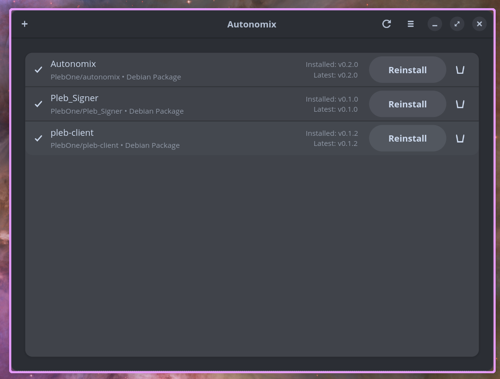

# Autonomix

A Linux package manager for GitHub releases. Similar to [Obtainium](https://github.com/ImranR98/Obtainium) for Android.



## Features

- 📦 Track GitHub releases from any repository
- 🔄 Check for updates with one click
- ⬇️ Install packages directly (.deb, .rpm, AppImage, Flatpak, Snap)
- 🔔 Self-updates included - Autonomix tracks its own releases
- 🎨 Modern GTK4/libadwaita interface

## Installation

### From Release

Download the latest `.deb` or `.rpm` package from the [Releases](https://github.com/PlebOne/autonomix/releases) page.

#### Debian/Ubuntu
```bash
sudo dpkg -i autonomix_*.deb
sudo apt-get install -f  # Fix any dependency issues
```

#### Fedora/RHEL
```bash
sudo dnf install autonomix-*.rpm
```

### From Source

Requirements:
- Rust 1.70+
- GTK4 development libraries
- libadwaita development libraries

```bash
# Install dependencies (Debian/Ubuntu)
sudo apt install libgtk-4-dev libadwaita-1-dev libgraphene-1.0-dev

# Install dependencies (Fedora)
sudo dnf install gtk4-devel libadwaita-devel graphene-devel

# Build and install
cargo build --release
sudo cp target/release/autonomix /usr/local/bin/
```

## Usage

1. Click the **+** button to add a GitHub repository
2. Enter the repository URL (e.g., `github.com/owner/repo` or just `owner/repo`)
3. Click **Add**
4. Click **Install** to install the latest release
5. Click the **Refresh** button to check for updates

## Supported Package Types

- `.deb` - Debian/Ubuntu packages (installed via dpkg)
- `.rpm` - Fedora/RHEL packages (installed via dnf or rpm)
- `.AppImage` - Portable applications (stored in ~/.local/share/autonomix/appimages)
- `.flatpak` - Flatpak bundles (installed to user)
- `.snap` - Snap packages

## How It Works

Autonomix uses the GitHub API to fetch release information. When you install a package:

1. The latest release is fetched from GitHub
2. The best matching asset is selected based on your system (architecture, package format)
3. The asset is downloaded to a temporary location
4. For system packages (.deb, .rpm, .snap), `pkexec` is used to install with elevated privileges
5. For user packages (AppImage, Flatpak), no elevation is needed

## Development

```bash
# Clone the repository
git clone https://github.com/PlebOne/autonomix.git
cd autonomix

# Run in development mode
cargo run

# Run tests
cargo test

# Build release
cargo build --release
```

## License

MIT License - see [LICENSE](LICENSE) for details.

## Credits

Built with:
- [GTK4](https://gtk.org/) and [libadwaita](https://gnome.pages.gitlab.gnome.org/libadwaita/)
- [Rust](https://www.rust-lang.org/)
- [tokio](https://tokio.rs/) for async runtime
- [reqwest](https://github.com/seanmonstar/reqwest) for HTTP
- [rusqlite](https://github.com/rusqlite/rusqlite) for database
